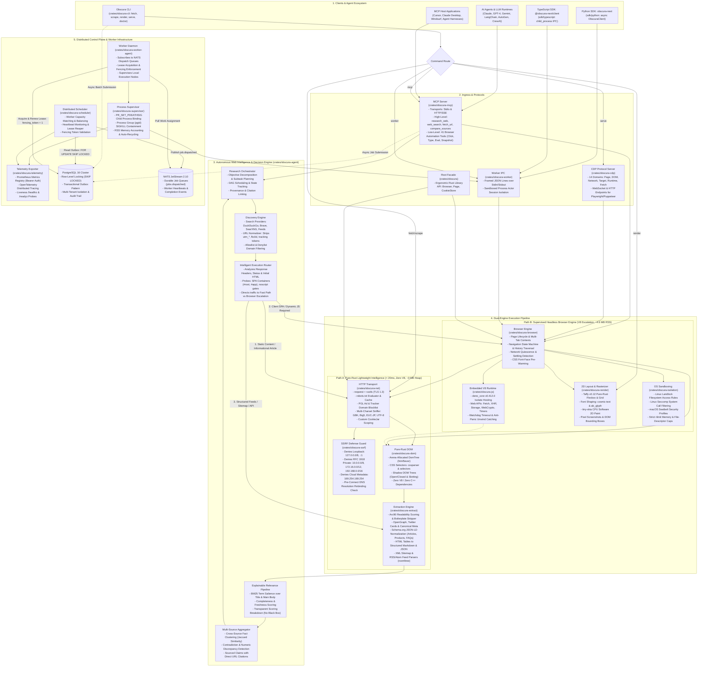

# Obscura — Complete End-to-End System Architecture

```mermaid
flowchart TD
    %% ==========================================
    %% 1. CLIENTS & INTEGRATION LAYER
    %% ==========================================
    subgraph TIER1["1. Clients & Agent Ecosystem"]
        Agents["AI Agents & LLM Runtimes\n(Claude, GPT-4, Gemini, LangChain, AutoGen, CrewAI)"]
        MCP_Hosts["MCP Host Applications\n(Cursor, Claude Desktop, Windsurf, Agent Harnesses)"]
        SDK_Py["Python SDK: obscura-next\n(sdk/python: async ObscuraClient)"]
        SDK_Ts["TypeScript SDK: @obscura-next/client\n(sdk/typescript: child_process IPC)"]
        CLI_Bin["Obscura CLI\n(crates/obscura-cli: fetch, scrape, render, serve, doctor)"]
    end

    %% ==========================================
    %% 2. INGRESS & PROTOCOL GATEWAYS
    %% ==========================================
    subgraph TIER2["2. Ingress & Protocols"]
        MCP_Srv["MCP Server (crates/obscura-mcp)\n- Transports: Stdio & HTTP/SSE\n- High-Level: research_web, web_search, fetch_url, compare_sources\n- Low-Level: 41 Browser Automation Tools (Click, Type, Eval, Snapshot)"]
        CDP_Srv["CDP Protocol Server (crates/obscura-cdp)\n- 14 Domains: Page, DOM, Network, Target, Runtime, Fetch\n- WebSocket & HTTP Endpoints for Playwright/Puppeteer"]
        Worker_IPC["Worker IPC (crates/obscura-worker)\n- Framed JSON Lines over Stdin/Stdout\n- Sandboxed Process Actor Session Isolation"]
        Facade_Lib["Root Facade (crates/obscura)\n- Ergonomic Rust Library API: Browser, Page, CookieStore"]
    end

    %% ==========================================
    %% 3. INTELLIGENCE & ORCHESTRATION
    %% ==========================================
    subgraph TIER3["3. Autonomous Web Intelligence & Decision Engine (crates/obscura-agent)"]
        Orchestrator["Research Orchestrator\n- Objective Decomposition & Subtask Planning\n- DAG Scheduling & State Tracking\n- Provenance & Citation Linking"]
        Discovery["Discovery Engine\n- Search Providers: DuckDuckGo, Brave, SearXNG, Feeds\n- URL Normalizer: Strips utm_*, fbclid, tracking tokens\n- Allowlist & Denylist Domain Filtering"]
        Relevance["Explainable Relevance Pipeline\n- BM25 Term Salience over Title & Main Body\n- Completeness & Freshness Scoring\n- Transparent Scoring Breakdown (No Black Box)"]
        Aggregator["Multi-Source Aggregator\n- Cross-Source Fact Clustering (Jaccard Similarity)\n- Contradiction & Numeric Discrepancy Detection\n- Sourced Claims with Direct URL Citations"]
        Router["Intelligent Execution Router\n- Analyzes Response Headers, Status & Initial HTML\n- Probes: SPA Containers (#root, #app), noscript gates\n- Directs traffic to Fast Path vs Browser Escalation"]
    end

    %% ==========================================
    %% 4. DUAL-ENGINE EXECUTION PIPELINE
    %% ==========================================
    subgraph TIER4["4. Dual-Engine Execution Pipeline"]
        subgraph PATH_A["Path A: Pure-Rust Lightweight Intelligence (< 20ms, Zero V8, ~0 MB Heap)"]
            Net["HTTP Transport (crates/obscura-net)\n- reqwest + rustls (TLS 1.3)\n- robots.txt Evaluator & Cache\n- PGL Ad & Tracker Domain Blocklist\n- Multi-Charset Sniffer: GBK, Big5, EUC-JP, UTF-8\n- Custom CookieJar Scoping"]
            SSRF["SSRF Defense Guard (crates/obscura-ssrf)\n- Denies Loopback: 127.0.0.0/8, ::1\n- Denies RFC 1918 Private: 10.0.0.0/8, 172.16.0.0/12, 192.168.0.0/16\n- Denies Cloud Metadata: 169.254.169.254\n- Pre-Connect DNS Resolution Rebinding Check"]
            DOM_Engine["Pure-Rust DOM (crates/obscura-dom)\n- Arena-Allocated DomTree (html5ever)\n- CSS Selectors: cssparser & selectors\n- Shadow DOM Trees (Open/Closed & Slotting)\n- Zero V8 / Zero C++ Dependencies"]
            Extractor["Extraction Engine (crates/obscura-extract)\n- Arc90 Readability Scoring & Boilerplate Stripper\n- OpenGraph, Twitter Cards & Canonical Meta\n- Schema.org JSON-LD Normalization (Articles, Products, FAQs)\n- HTML Tables to Structured Markdown & JSON\n- XML Sitemap & RSS/Atom Feed Parsers (roxmltree)"]
        end

        subgraph PATH_B["Path B: Supervised Headless Browser Engine (V8 Escalation, ~4.6 MB RSS)"]
            Browser_Core["Browser Engine (crates/obscura-browser)\n- Page Lifecycle & Multi-Tab Contexts\n- Navigation State Machine & History Traversal\n- Network Quiescence & Settling Detection\n- CSS Font-Face Pre-Warming"]
            V8_Runtime["Embedded V8 Runtime (crates/obscura-js)\n- deno_core v0.412.0 Isolate Hosting\n- Web APIs: Fetch, XHR, Storage, WebCrypto, Timers\n- Watchdog Timeout & Anti-Panic Unwind Catching"]
            Render_Core["2D Layout & Rasterizer (crates/obscura-render)\n- Taffy v0.12 Pure-Rust Flexbox & Grid\n- Font Shaping: cosmic-text & ab_glyph\n- tiny-skia CPU Software 2D Paint\n- Pixel Screenshots & DOM Bounding Boxes"]
            OS_Isolation["OS Sandboxing (crates/obscura-isolation)\n- Linux Landlock Filesystem Access Rules\n- Linux Seccomp System Call Filtering\n- macOS Seatbelt Security Profiles\n- Strict rlimit Memory & File-Descriptor Caps"]
        end
    end

    %% ==========================================
    %% 5. DISTRIBUTED CONTROL PLANE & INFRASTRUCTURE
    %% ==========================================
    subgraph TIER5["5. Distributed Control Plane & Worker Infrastructure"]
        Scheduler["Distributed Scheduler (crates/obscura-scheduler)\n- Worker Capacity Matching & Balancing\n- Heartbeat Monitoring & Lease Reaper\n- Fencing Token Validation"]
        Worker_Agent["Worker Daemon (crates/obscura-worker-agent)\n- Subscribes to NATS Dispatch Queues\n- Lease Acquisition & Fencing Enforcement\n- Supervises Local Execution Nodes"]
        Supervisor["Process Supervisor (crates/obscura-supervisor)\n- PR_SET_PDEATHSIG Child Process Binding\n- Process Group (pgid) SIGKILL Containment\n- RSS Memory Accounting & Auto-Recycling"]
        Telemetry["Telemetry Exporter (crates/obscura-telemetry)\n- Prometheus Metrics Registry (Bearer Auth)\n- OpenTelemetry Distributed Tracing\n- Liveness /healthz & /readyz Probes"]
        Postgres[("PostgreSQL 16 Cluster\n- Row-Level Locking (SKIP LOCKED)\n- Transactional Outbox Pattern\n- Multi-Tenant Isolation & Audit Trail")]
        NATS[("NATS JetStream 2.10\n- Durable Job Queues (jobs.dispatched)\n- Worker Heartbeats & Completion Events")]
    end

    %% ==========================================
    %% CONNECTIONS & FLOWS
    %% ==========================================
    %% Ingress connections
    Agents --> MCP_Srv
    MCP_Hosts --> MCP_Srv
    SDK_Py --> Worker_IPC
    SDK_Ts --> Worker_IPC
    CLI_Bin --> Ingress_Route{"Command Route"}
    Ingress_Route -->|fetch/scrape| Net
    Ingress_Route -->|render| Render_Core
    Ingress_Route -->|mcp| MCP_Srv
    Ingress_Route -->|serve| CDP_Srv
    Ingress_Route -->|worker| Worker_IPC

    %% Ingress to Logic
    MCP_Srv --> Orchestrator
    MCP_Srv --> Browser_Core
    CDP_Srv --> Browser_Core
    Worker_IPC --> Browser_Core
    Facade_Lib --> Browser_Core
    Facade_Lib --> Net

    %% Intelligence Flow
    Orchestrator --> Discovery
    Discovery --> Router
    
    %% Routing Decisions
    Router -->|1. Static Content / Informational Article| Net
    Router -->|2. Client SPA / Dynamic JS Required| Browser_Core
    Router -->|3. Structured Feeds / Sitemap / API| Extractor

    %% Path A Wiring
    Net --> SSRF
    Net --> DOM_Engine
    DOM_Engine --> Extractor
    Extractor --> Relevance
    Relevance --> Aggregator
    Aggregator --> Orchestrator

    %% Path B Wiring
    Browser_Core --> DOM_Engine
    Browser_Core --> V8_Runtime
    Browser_Core --> Render_Core
    Browser_Core --> OS_Isolation
    Browser_Core --> Net
    V8_Runtime -.-> DOM_Engine

    %% Distributed Control Plane Wiring
    MCP_Srv -.->|Async Job Submission| Postgres
    CLI_Bin -.->|Async Batch Submission| Postgres
    Scheduler -->|Read Outbox: FOR UPDATE SKIP LOCKED| Postgres
    Scheduler -->|Publish job.dispatched| NATS
    Worker_Agent -->|Pull Work Assignment| NATS
    Worker_Agent -->|Acquire & Renew Lease: fencing_token + 1| Postgres
    Worker_Agent --> Supervisor
    Supervisor --> Worker_IPC
    Supervisor --> Telemetry
    Scheduler --> Telemetry
```
